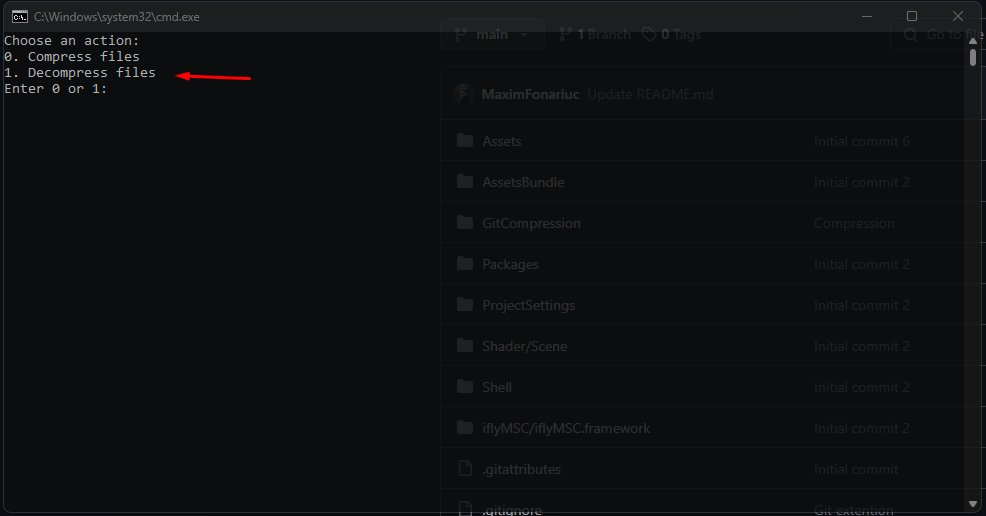
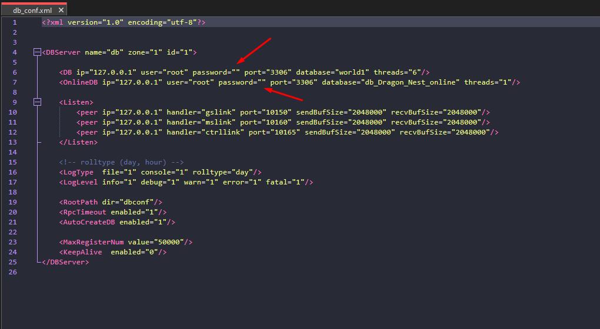
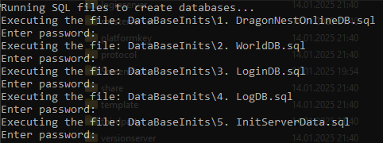
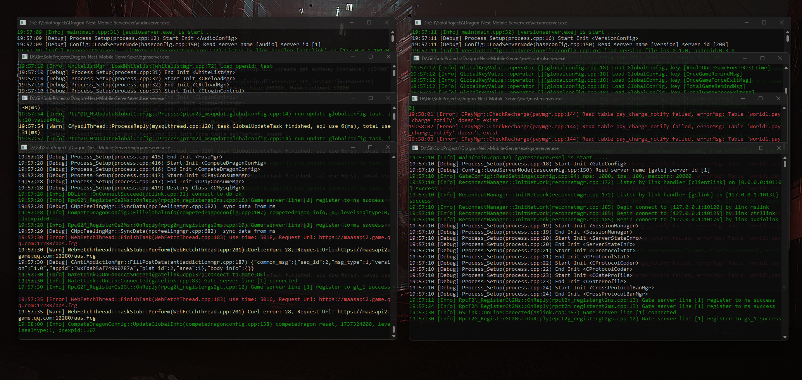
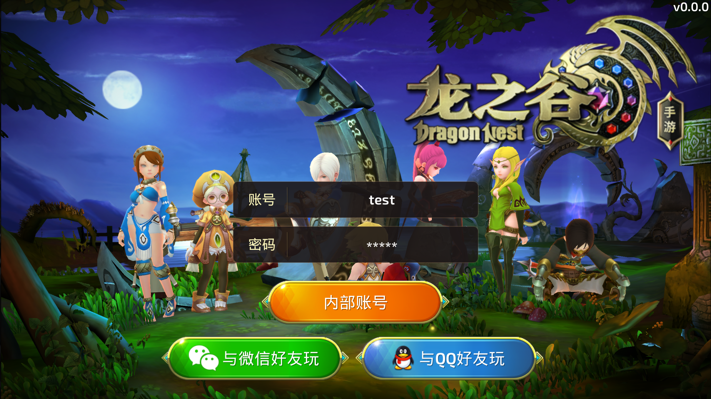
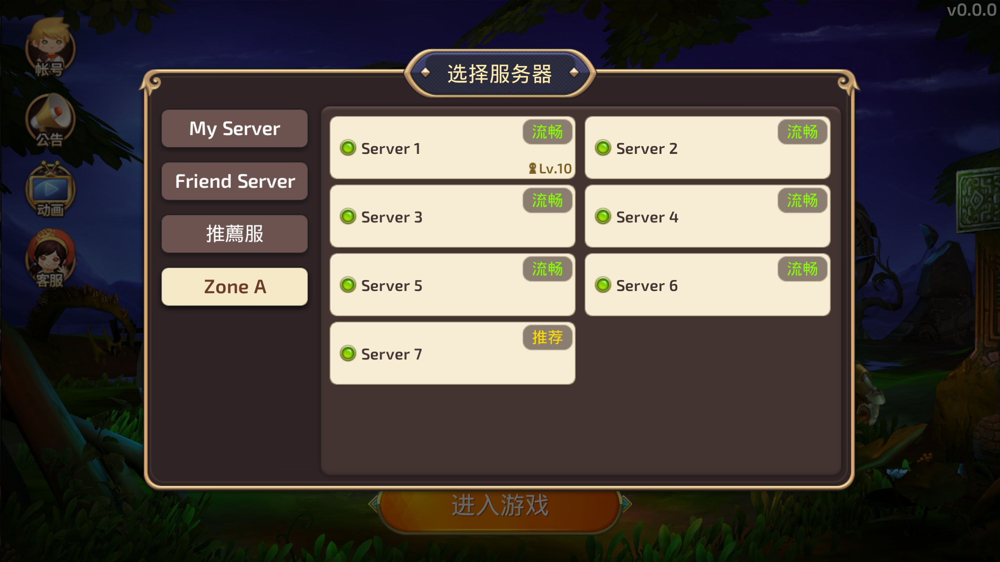

# Dragon-Nest-Mobile-Server

[Русская версия](README_RU.md)

This is the server-side component for the **Dragon Nest Mobile** game. The code has been partially refactored, and all necessary `.exe` files have been compiled, allowing the server to be run without additional setup. Below are the instructions for configuring and running the server.

---

## Table of Contents
1. [Description](#description)
2. [Requirements](#requirements)
3. [Server Setup](#server-setup)
4. [Running the Server](#running-the-server)
5. [Client Connection](#client-connection)
6. [Repository Links](#repository-links)

---

## Description

The server-side component of **Dragon Nest Mobile** is responsible for handling game logic, storing data, and interacting with the client. The project has been partially refactored, and all necessary `.exe` files have been compiled, allowing the server to be run without additional compilation.

---

## Requirements

The following components are required to run the server:
- **MySQL 8.0**: Database server.
- **Visual Studio 10 (C++ 10)**: For working with the server's source code (if modifications are needed).
- **Python 3.12**: For running auxiliary scripts.
- **Git**: For cloning the repository.

---

## Server Setup

1. **Extract Heavy Files**  
   First, extract all heavy files using the `LFSUtility.bat` utility. Run this file from the project's root directory.
   

2. **Configure MySQL**  
   - Install and run the **MySQL 8.0** server.
   - Set up the database connection with the following parameters:
     - Address: `root@127.0.0.1`
     - Password: `""` (empty password).  
     If you want to use a password for your database, you will need to update the connection parameters in all `.xml` configuration files in /exe/conf/.  
     

3. **Initialize the Database**  
   - Run the `INITIALIZE_DATABASE.bat` file. This script will automatically create all necessary databases, game servers, and a default user.
   - To explore or add additional servers or users, refer to the `DataBaseInits/5. InitServerData.sql` file.
   

---

## Running the Server

1. **Start the Server**  
   After setting up the database, run the `START_SERVER.bat` file.  
   - Eight `cmd` windows should appear, each handling a specific part of the server logic.  
   - If fewer windows appear, check your MySQL configuration.
   

2. **Verify Server Operation**  
   If everything starts correctly, the server is ready to use.

---

## Client Connection

1. **Run the Client**  
   Go to the client-side project and launch the game.  
   - For a test login, use:  
     - Username: `Test`  
     - Password: `12345`  
   - You can create additional accounts later.
      

2. **Check Connection**  
   Ensure that the client successfully connects to the server and transitions to the login screen.
   

---

## Repository Links

- **Client Repository**: [Dragon-Nest-Mobile-Client](https://github.com/MaximFonariuc/Dragon-Nest-Mobile-Client)
- **Server Repository**: [Dragon-Nest-Mobile-Server](https://github.com/MaximFonariuc/Dragon-Nest-Mobile-Server)

---

## Notes

- Ensure all dependencies are installed and configured correctly.
- If you encounter issues running the server, check your MySQL settings and the correctness of the database setup.
